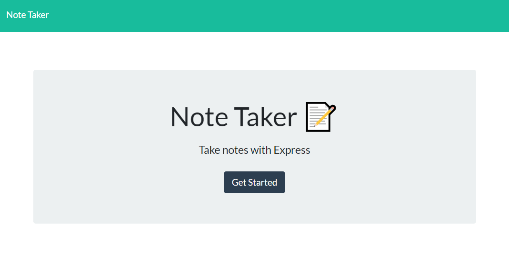
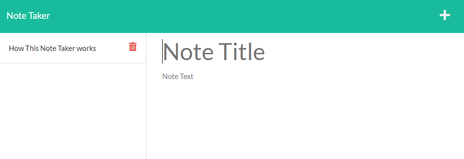
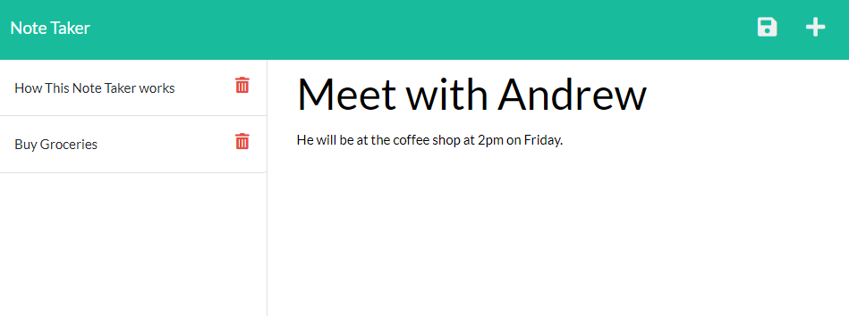

# Note Taker

## Table of Contents

- [Note Taker](#note-taker)
  - [Table of Contents](#table-of-contents)
  - [Description](#description)
  - [Deployment](#deployment)
  - [Installation](#installation)
  - [Usage](#usage)
  - [Screenshots](#screenshots)
  - [License](#license)

## Description

A Note taking app deployed to Heroku. This app uses Express to handle HTTPS and API calls. This app lets you write and save notes to a DB and delete them when no longer needed. 

## Deployment

You can find this website deployed on Heroku here: [https://stormy-castle-44582.herokuapp.com//](https://stormy-castle-44582.herokuapp.com/)

## Installation

Download Files onto local machine and run `npm start`. The note taker app will then be running on your computer, on port 3001. 

## Usage

Open Webpage and hit Get Started. That will than allow you to write and add new notes to your collection. 

## Screenshots

## License

This project is licensed under a [MIT license](https://opensource.org/licenses/MIT).